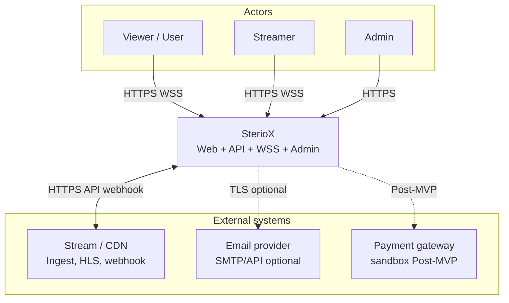
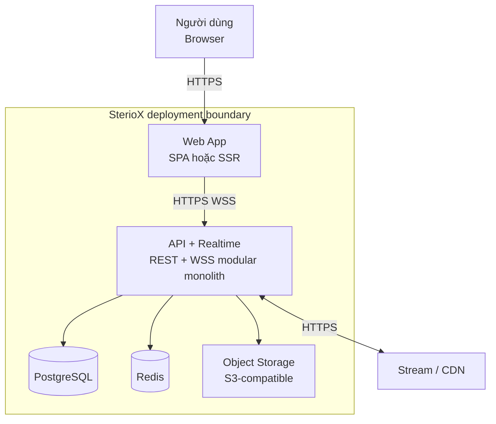
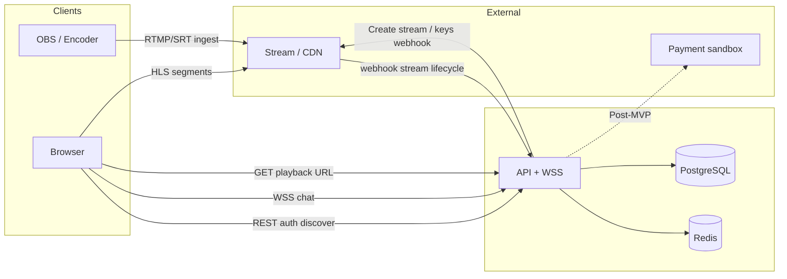
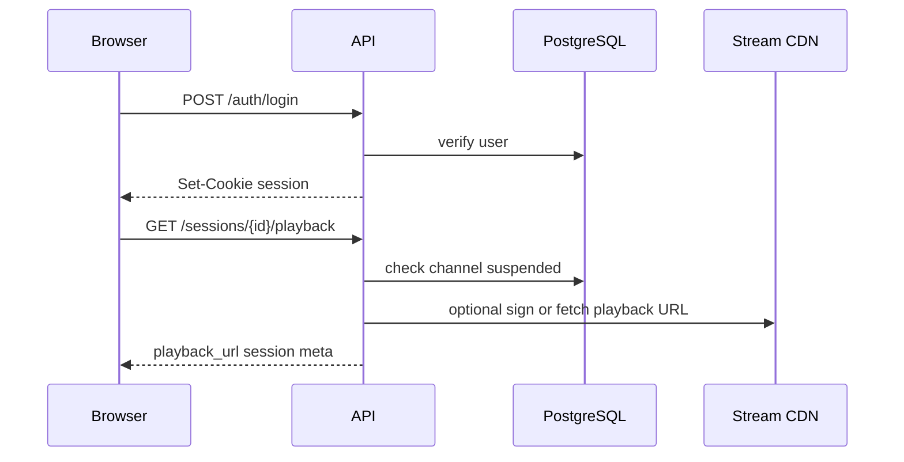
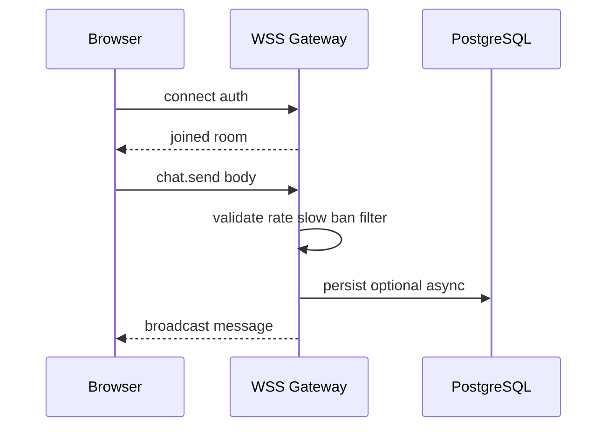
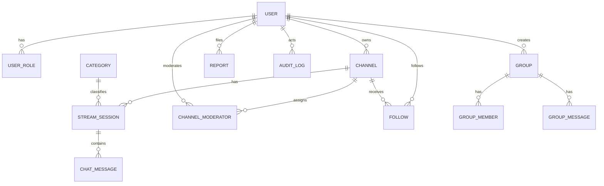

# SterioX — Technical Design

## Kiến trúc tổng thể

### Phong cách kiến trúc được chọn

**Modular architecture + client/server**, trong đó backend được tổ chức theo các module nghiệp vụ độc lập trong một codebase và client giao tiếp với server qua API/WS. Đường video (ingest/delivery) được tách sang **nhà cung cấp CDN/streaming** bên thứ ba. Không áp dụng microservices đầy đủ ở MVP để giảm độ phức tạp vận hành và phù hợp phạm vi đồ án/học tập trong [Product Vision](../analysis/Product_Vision.md), đồng thời vẫn đáp ứng SRS: tầng ứng dụng **stateless**, scale-out ngang khi cần (SRS §5.4).

**Lý do phù hợp yêu cầu**

| Yếu tố | Cách đáp ứng |
| :--- | :--- |
| Realtime chat, thông báo | WebSocket (WSS) do cùng domain API hoặc service nhẹ đồng bộ session; horizontal scale qua sticky optional + Redis adapter (giả định triển khai — xem ADR) |
| Video live | Ingest RTMP/SRT (theo nhà cung cấp) → transcode/ABR → HLS delivery; SterioX chỉ quản lý **khóa, URL, trạng thái phiên**, không tự host video origin ở MVP |
| RBAC, audit, báo cáo | Một codebase phân **module** theo bounded context: Identity, Channel, LiveSession, Chat, Community, Moderation, Admin, Billing (Post-MVP) |
| NFR (latency API, logging) | API REST có OpenAPI; logging có correlation id; p95 đọc/ghi theo SRS §5.1 |

### Thành phần hệ thống và giao tiếp

1. **Web client (browser):** UI responsive; gọi REST/JSON qua HTTPS; kết nối WSS cho chat phòng live và group chat; trình phát HLS (hoặc tương đương) lấy URL playback từ API.
2. **Backend API (SterioX Core):** Xác thực, RBAC, CRUD nghiệp vụ, webhook từ CDN/stream (stream started/stopped), enqueue job (Post-MVP: VOD, email).
3. **PostgreSQL:** Dữ liệu giao dịch, người dùng, kênh, phiên live, chat (hoặc chat hot path + archive — ADR).
4. **Redis (khuyến nghị):** Rate limit (REQ-062), session denylist/refresh rotation, optional Pub/Sub cho fan-out WebSocket giữa nhiều instance.
5. **Object storage (S3-compatible / provider blob):** Avatar, ảnh bìa group (REQ-015, REQ-049).
6. **Dịch vụ stream/CDN (external):** Cấp ingest URL + stream key; playback URL; webhook/signal trạng thái (REQ-022–023).
7. **Payment sandbox (Post-MVP):** HTTP API + webhook; không lưu thẻ; ledger nội bộ (REQ-080–081).
8. **SMTP/API email (optional):** Reset password, thông báo (REQ-005, REQ-075).

### Mapping requirement → thiết kế (rút gọn)

| Nhóm SRS | Thiết kế kỹ thuật |
| :--- | :--- |
| REQ-001–008 | Module Identity: register/login/lockout/password hash/reset token TTL |
| REQ-009–014 | RBAC middleware + policy per route; bảng `user_roles`, `channel_moderators` |
| REQ-020–036 | Module LiveSession + tích hợp provider; `join_stream` analytics event |
| REQ-037–046 | WebSocket gateway + validation + fan-out; lưu tin (tuỳ chọn persistence depth) |
| REQ-047–052 | Module Community: `follows`, `groups`, `group_messages` |
| REQ-053–057 | Read model/API discover + index search |
| REQ-058–068 | Module Moderation + Admin API + audit |
| REQ-073–074 | `notifications` + polling hoặc WS topic `user:{id}` |
| REQ-080–081 (Post-MVP) | Module Billing: idempotency key, `ledger_entries`, webhook handler |

### Use Case diagram (tham chiếu)

Sơ đồ `Usecase.png` thể hiện quan hệ kế thừa **User → Viewer → Streamer** và **Admin** độc lập; luồng **Donate gift** `<<include>>` **Buy gift** → **Payment** với actor **«system»**. Thiết kế phân quyền: token/session của Streamer **bao gồm** quyền Viewer (endpoint chung phải kiểm tra role bitmask hoặc separate claims); Payment chỉ kích hoạt khi bật module Post-MVP.

---

## C4 Diagram

### Level 1 — System Context

SterioX nằm giữa **người dùng** (Streamer, Viewer, Admin) và các **hệ thống ngoài**: CDN/streaming, (tùy chọn) email, (Post-MVP) cổng thanh toán sandbox.

*Ghi chú:* Biểu diễn tương đương C4 Level 1; có thể vẽ lại bằng Structurizr/C4-PlantUML trong tài liệu kiến trúc đầy đủ nếu dự án yêu cầu.

### Level 2 — Container

**Trách nhiệm container**

| Container | Trách nhiệm chính |
| :--- | :--- |
| Web App | Routing, layout responsive (SRS §3.1), player, kết nối chat, form auth |
| API + Realtime | OpenAPI, authz, nghiệp vụ, WebSocket rooms theo `stream_session_id` / `group_id` |
| PostgreSQL | Source of truth cho user, channel, session, report, audit |
| Redis | Sliding window rate limit; optional adapter Socket.io/redis |
| Object Storage | File tĩnh người dùng upload; URL signed TTL |

---

## High-Level Architecture Diagram

Luồng dữ liệu chính: **phát** (OBS → CDN ingest), **xem** (browser → CDN HLS), **điều khiển & chat** (browser ↔ API/WSS), **webhook** (CDN → API cập nhật trạng thái live).

**Luồng phiên live (happy path)**

1. Streamer mở Studio → API tạo/cấp ingest credentials (REQ-020).
2. Streamer bắt đầu send từ OBS → CDN nhận ingest.
3. CDN/API nhận tín hiệu → cập nhật `stream_sessions.status = LIVE` trong SLA nội bộ (REQ-022).
4. Viewer mở phòng → API trả `playback_url` (REQ-032); player tải từ CDN; ghi `join_stream` (REQ-036).
5. Viewer chat → WSS → API validate (slow mode, ban, rate — REQ-039–045, 062) → broadcast room.

**Luồng báo cáo & Admin**

Viewer gửi report (REST) → `reports.status = OPEN` → Admin đọc queue → cập nhật trạng thái + audit (REQ-060, REQ-069).

**Bề mặt API (tham chiếu triển khai — OpenAPI là nguồn chân lý, SRS §3.3)**

| Method | Endpoint | Auth | Ghi chú |
| :--- | :--- | :--- | :--- |
| POST | `/auth/register` | Public | REQ-001–003 |
| POST | `/auth/login` | Public | REQ-004, rate limit |
| POST | `/auth/logout` | User | REQ-006 |
| POST | `/auth/password-reset/request` | Public | REQ-005 |
| GET | `/me` | User | REQ-014 |
| GET | `/discover/live` | Public / Khách | REQ-053–057 |
| GET | `/channels/{slug}` | Public | Trang kênh |
| GET | `/sessions/{id}/playback` | Public | REQ-032–033 |
| POST | `/sessions` | Streamer | Tạo / cập nhật metadata phiên |
| POST | `/sessions/{id}/ingest-key/rotate` | Streamer | REQ-020 |
| WS | `/ws/chat?session_id=` | User | REQ-037–046 |
| POST | `/reports` | User | REQ-058–061 |
| GET/POST | `/admin/...` | Admin | REQ-064–068 |

**Mã lỗi chuẩn hóa (ví dụ):** `VALIDATION_ERROR`, `UNAUTHORIZED`, `FORBIDDEN`, `CHANNEL_SUSPENDED`, `RATE_LIMIT`, `REPORT_RATE_LIMIT`, `CHAT_NOT_ALLOWED`, `PAYMENT_UNAVAILABLE`.

**Sequence — đăng nhập và tải phòng live**

**Sequence — gửi tin chat (WSS)**

---

## Thiết kế cơ sở dữ liệu

### Lựa chọn và lý do

**PostgreSQL** (SRS §3.3): quan hệ rõ ràng cho RBAC, audit, ledger; transaction ACID cho báo cáo + audit và idempotency Post-MVP; index và full-text search đơn giản cho MVP (REQ-055).

### Thực thể chính (logical schema)

| Thực thể | Mô tả | REQ tham chiếu |
| :--- | :--- | :--- |
| `users` | id, email unique, password_hash, status, last_login_at | REQ-001–008 |
| `user_roles` | user_id, role enum (VIEWER, STREAMER, ADMIN), optional | REQ-009 |
| `channels` | id, owner_user_id, slug, title, bio, suspended_until, … | REQ-016–017, 066 |
| `channel_moderators` | channel_id, moderator_user_id | REQ-019, REQ-011 |
| `categories` | id, name, hidden | REQ-027, REQ-065 |
| `stream_sessions` | id, channel_id, title, category_id, status, started_at, ended_at, provider_stream_id | REQ-024–026, 028 |
| `stream_session_tags` | session_id, tag normalized | REQ-029–030 |
| `chat_messages` | id, session_id, user_id, body, created_at, deleted_at | REQ-037–042 |
| `follows` | follower_id, channel_id unique | REQ-047 |
| `groups` | id, owner_id, name, membership_mode, … | REQ-049–050 |
| `group_members` | group_id, user_id, role | REQ-052 |
| `group_messages` | id, group_id, user_id, body, … | REQ-051 |
| `reports` | id, reporter_id, target_type, target_id, reason, status, … | REQ-058–060 |
| `audit_logs` | id, actor_id, action, target_id, payload jsonb, created_at | REQ-069–070 |
| `notifications` | id, user_id, type, read_at, payload | REQ-073–074 |
| `password_reset_tokens` | user_id, token_hash, expires_at | REQ-005 |
| `ledger_entries` (Post-MVP) | idempotency_key unique, provider_ref, amount_cents, currency, status | REQ-080–081 |

### Ràng buộc & index gợi ý

- **PK:** UUID hoặc BIGSERIAL thống nhất; khóa ngoại `ON DELETE` theo chính sách (soft-delete user → giữ audit).
- **Unique:** `users.email`, `(follower_id, channel_id)`, `ledger_entries.idempotency_key`.
- **Index:** `stream_sessions(channel_id, status)`, `chat_messages(session_id, created_at)`, `reports(status, created_at)`, `channels(owner_user_id)`, search `(lower(title), lower(slug))` hoặc `pg_trgm` cho REQ-055 (*TBD* workload).
- **Chat tại scale lớn:** partition theo `session_id` hoặc chuyển hot path sang Redis stream (*chỉ khi đo được — ngoài MVP*).

### ERD (Mermaid)

---

## Thiết kế kiểm soát truy cập

### Mô hình: RBAC + kiểm tra theo tài nguyên

- **Global roles** (REQ-009): `VIEWER`, `STREAMER`, `ADMIN` lưu tại `user_roles` (một user có thể có nhiều role; ví dụ Streamer cũng là Viewer).
- **Scoped role:** `CHANNEL_MODERATOR` thể hiện qua bảng `channel_moderators` (REQ-011); mọi API mod phải kiểm tra `channel_id` khớp assignment.
- **Admin** (REQ-012): guard riêng namespace `/admin/*` và policy `RequireRole(ADMIN)`.

### Ma trận quyền (rút gọn)

| Hành động | Viewer | Streamer (owner) | Mod kênh | Admin |
| :--- | :---: | :---: | :---: | :---: |
| Xem phòng live công khai | ✓ | ✓ | ✓ | ✓ |
| Chat | ✓ | ✓ | ✓ | ✓ |
| Follow | ✓ | ✓ | ✓ | ✓ |
| Tạo ingest / đặt title session | | ✓ | | ✓* |
| Timeout/ban/xóa chat trên kênh | | ✓ | ✓ | ✓ |
| CRUD category / suspend channel | | | | ✓ |

\*Chỉ khi chính sách nghiệp vụ cho phép Admin can thiệp kênh — mặc định có (REQ-066).

### Cơ chế kỹ thuật

1. **Đăng nhập:** Session cookie `HttpOnly; Secure; SameSite=Lax` **hoặc** access JWT ngắn hạn + refresh token rotation (ADR). SRS yêu cầu cookie an toàn nếu dùng cookie (§5.3).
2. **Mỗi request REST:** middleware `Authenticate` → `Authorize(policy)` → handler; resource ID từ route (channel_id, session_id) phải khớp ownership hoặc mod list.
3. **WebSocket:** handshake kèm cookie/token; join room chỉ sau khi server verify quyền đọc session đó; rate limit publish (REQ-062).

### Kế thừa vai trò (Use Case diagram)

Thiết kế **không** nhân đôi user record: một `user_id` có role `STREAMER` đồng thời có quyền Viewer. API list “quyền hiệu tại” (REQ-014) trả về tập role + moderator scopes để frontend ẩn/hiện đúng menu.

---

## Thiết kế các cơ chế bảo vệ hệ thống

### Kiểm soát tải đột biến

**Mục tiêu:** Đáp ứng REQ-062 (login, chat), REQ-061 (reports), REQ-063 (CAPTCHA khi vượt ngưỡng), và SRS §5.1 (throughput chat).

**Giải pháp**

| Lớp | Cách làm |
| :--- | :--- |
| Edge / reverse proxy | Giới hạn kết nối đồng thời theo IP (nginx `limit_conn`) |
| Ứng dụng | Sliding window **Redis** key `ratelimit:{route}:{user_or_ip}`; từ chối với HTTP 429 + `Retry-After` |
| Chat WSS | Giới hạn message/sec per connection và per user; drop hoặc queue ngắn (*TBD backlog size*) |
| CAPTCHA | Sau N lần login fail hoặc burst đăng ký (REQ-063); verify server-side token |

**Hành vi khi vượt ngưỡng:** trả **429** với mã chuẩn hóa `RATE_LIMIT`; không ghi side-effect (không tạo report, không ghi chat); log metric `rate_limit_hit`.

### Xử lý cổng thanh toán không ổn định

*Áp dụng Post-MVP / module sandbox (REQ-080–081, Product Vision Giai đoạn 2).*

**Trạng thái giao dịch nội bộ:** `INITIATED` → `PENDING_PROVIDER` → `SUCCEEDED` | `FAILED` | `CANCELLED`. Webhook và response redirect có thể đến không theo thứ tự — xử lý bằng **state machine** idempotent: mọi chuyển trạng thái chỉ từ trạng thái cho phép.

**Ngưỡng & hành vi**

- Timeout HTTP client gọi provider: **10–15 s** với retry **exponential backoff** tối đa 3 lần cho lỗi idempotent (network); không retry POST thanh toán trùng nội dung mà không có idempotency key.
- Webhook: xác minh chữ ký provider; trả 200 sau khi ghi DB trong transaction; nếu DB fail → trả 5xx để provider retry (theo tài liệu provider).
- **Circuit breaker:** sau M lỗi liên tiếp, ngừng gọi provider 30–60 s, trả `PAYMENT_UNAVAILABLE` cho UI.

### Chống trừ tiền hai lần

*Liên quan Use Case: Donate gift `<<include>>` Buy gift → Payment; SRS REQ-080 idempotency + REQ-081 ledger.*

**Cơ chế**

1. Client hoặc server sinh **`Idempotency-Key`** UUID cho mỗi ý định thanh toán; header bắt buộc trên `POST /billing/intents` (hoặc tương đương).
2. Bảng `ledger_entries`: **UNIQUE(idempotency_key)**; insert đầu tiên thắng, insert sau trả bản ghi hiện có (không tạo giao dịch mới).
3. Mọi cập nhật số dư/wallet (nếu có) trong **một transaction** với insert ledger.
4. **TTL:** bản ghi `INITIATED` quá 24h chưa SUCCEEDED → job định kỳ đánh dấu `EXPIRED` (*TBD* theo chính sách sản phẩm).
5. **Webhook** provider: tra cứu theo `provider_payment_id`; nếu đã `SUCCEEDED` thì no-op idempotent.

**Lưu trữ:** PostgreSQL là source of truth; không lưu PAN/CVV; chỉ lưu reference sandbox.

---

## Các quyết định kỹ thuật quan trọng (ADR)

### ADR-001 — Modular monolith thay vì microservices (MVP)

- **Bối cảnh:** Cần ship MVP nhanh, đội nhỏ, NFR “best effort” demo.
- **Quyết định:** Một deployable API với module boundaries rõ; tách process worker sau nếu cần queue.
- **Đánh đổi:** Scale độc lập từng service khó hơn; trade-off chấp nhận được cho phạm vi hiện tại.

### ADR-002 — PostgreSQL làm primary datastore

- **Quyết định:** PostgreSQL cho mọi domain MVP + ledger Post-MVP.
- **Đánh đổi:** Chat cực lớn có thể cần partition/NoSQL sau; chấp nhận cho mục tiêu throughput SRS (50 msg/s/phòng lab).

### ADR-003 — Realtime: WebSocket native (hoặc Socket.IO) colocated với API

- **Bối cảnh:** REQ-037 WSS; cần đơn giản triển khai.
- **Quyết định:** WSS cùng service API sau reverse proxy; scale-out với Redis adapter nếu >1 instance.
- **Đánh đổi:** Sticky session hoặc shared subscription state; phải cấu hình LB đúng.

### ADR-004 — Video: tích hợp managed stream/CDN (implementation TBD)

- **Quyết định:** Không tự host origin video; dùng API nhà cung cấp (MUX / Cloudflare Stream / AWS IVS / … — **TBD**).
- **Đánh đổi:** Chi phí & giới hạn trial; vendor lock-in một phần — đổi vendor qua abstraction `StreamProvider` interface.

### ADR-005 — Auth: session cookie vs JWT

- **Quyết định mặc định:** Session server-side (Redis hoặc DB) + cookie `HttpOnly` để đơn giản revoke và CSRF double-submit token cho mutation; **hoặc** JWT access ngắn + refresh nếu stack frontend ưa thích stateless — ghi rõ trong repo ADR con khi chốt.
- **Trace:** SRS §5.3 cookie flags.

### ADR-006 — OWASP & validation

- **Quyết định:** Validation input ở boundary (DTO schema); ORM/param hóa SQL; CSP + XSS hygiene; CSRF protection cho cookie session (SRS §5.3).

### ADR-007 — Observability

- **Quyết định:** Structured JSON logs + `X-Request-Id`; metrics Prometheus-compatible; health `/healthz` kiểm DB + Redis + provider ping nhẹ (SRS §5.4).

---

*Tài liệu này phải được cập nhật khi ADR-004 chốt nhà cung cấp stream cụ thể hoặc khi thêm microservice/worker tách biệt.*
